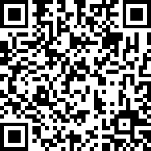

# Stelle LED

Cornice foto smart (DIY) con controllo WiFi, telaio di legno 15X20 cm, Noce. Basato su firmware [WLED v0.10](hw/WLED_0.10.2_ESP8266.bin)

## Quick Start

1. Connettere il dispositivo alla rete elettrica. Consigliato 12V-2A.

2. Utilizzare un dispositivo WiFi per connettersi al punto di accesso STELLE-AP utilizzando la password predefinita "stelle". Puoi anche eseguire la scansione di questo codice QR:

3. Vai all'IP 4.3.2.1 nel tuo browser. Dovresti anche essere in grado di utilizzare il server DNS incorporato e connetterti a wled.me

4. Modificare le impostazioni (WiFi Setup) per collegare il modulo al tuo WiFi di casa.

5. Controlla l'elenco dei dispositivi dal router per trovare l'IP del dispositivo all'interno della rete locale, oppure effettua una scansione. Per una gestione più semplice usa l'app [WLED](https://apps.apple.com/kw/app/wled/id1475695033)!

## Macro

1. FX=~
2. T=2

Single click per scorrere tutti gli effetti, spegnimento e accensione (toggle) con pressione prolungata.

L'effetto al boot può essere modificato tramite l'interfaccia web.

### Pianificazioni

1. Spegnimento automatico alle 00:00

### Aggiornamento

Il software ha capacità di aggiornamento del software OTA.